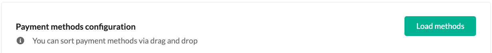

## Mollie payment methods synchronization

1. After first loading of Mollie payment methods, they will be synchronized periodically.
2. The overall synchronization process works as follows:
   - For already loaded methods, synchronization will only update their minimum and maximum transaction limits.
   - If a new method becomes available in Mollie, it will be added automatically, but still needs to be manually enabled for use in the shop.
   - In the case a method is removed from Mollie, it will be removed from the shop as well.
3. Manual synchronization can be triggered by pressing the **Load methods** button in the Mollie gateway configuration. 

   

   This synchronization disregards cache and forces fetching the latest payment methods from Mollie immediately, using the same synchronization rules as in the previous point.
4. Automatic synchronization gets triggered in two places:
   - During checkout, after a customer addresses the order (going from the addressing step further in the checkout process)
   - When accessing a Mollie-based payment method's update page in the admin panel
5. Any kind of synchronization will create a 2-hour cache, preventing further synchronizations during that time. The cache is stored in the Symfony's `cache.app` pool. No specific data gets stored, it's just an indicator when the last synchronization happened for a given gateway configuration.
6. The lifetime of the cache can be configured via the `sylius_mollie.mollie_payment_methods_refresh_ttl` parameter, which is set to `7200` seconds (2 hours) by default.
